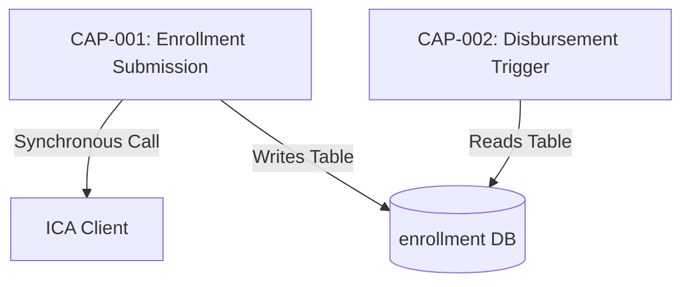

# OpenSpec Custom Skill: /opsx:build-baseline

## Command
/opsx:build-baseline

## Description
Stateful, human-in-the-loop reverse engineering skill for OpenSpec. Builds baseline specifications incrementally, generates cross-capability dependency maps, catalogs RAID risks, and maintains a valid OpenSpec source-of-truth.

---

## EXECUTION WORKFLOW & STATE MACHINE

Inspect `openspec/specs/CAPABILITIES_TREE.md` to identify project state. Execute ONLY ONE PHASE at a time, write the output file, and **STOP TO ASK FOR HUMAN CONFIRMATION**.

---

### PHASE 1: System Reconnaissance
**Condition:** `openspec/specs/SYSTEM_MAP.md` DOES NOT EXIST.

**Action:**
1. Scan repository structure, build scripts, and DB schema/migrations.
2. Identify entry points (controllers, API routes, background workers, event consumers).
3. Write a valid OpenSpec system map to `openspec/specs/SYSTEM_MAP.md`.

**Output Schema (`openspec/specs/SYSTEM_MAP.md`):**
```markdown
---
type: system_map
version: 1.0.0
entry_points_count: <number>
---

# System Map

## Components & Modules
- **Controllers:** `<file-list>`
- **Database Migrations:** `<file-list>`

## Discovered Entry Points
- `<method> <path>` -> `<Class.method>` (`file:lines`)
  ```

**Human Prompt (STOP HERE):**
> "Phase 1 Complete: System Map written to `openspec/specs/SYSTEM_MAP.md`.
> Review the entry points. Type **'yes'** to generate the Capability Tree or provide feedback."

---

### Note for PHASE 2 & 3: File Threshold Guardrail & Recursive Slicing

**File Budget Threshold:** Maximum 5 source files per single analysis pass.

Before analyzing any capability:
1. Count the target source files associated with the capability.
2. **If Target Files > 5:**
    - **DO NOT** read all files at once.
    - Automatically split the capability into sub-capabilities based on execution stages:
        - `CAP-XXXa (Validation & Request Parsing)` -> Reads Controller, DTOs, Annotation classes.
        - `CAP-XXXb (Core Business Domain Logic)` -> Reads Service, Strategy, Model classes.
        - `CAP-XXXc (Persistence & Event Mutation)` -> Reads Repository, Entity, SQL Migrations.
    - Update `openspec/specs/CAPABILITIES_TREE.md` with these newly created sub-slices.
    - Prompt User: *"Capability `<id>` spans `<N>` files. I have split it into child slices (`CAP-XXXa`, `CAP-XXXb`, `CAP-XXXc`) to keep accuracy high. Proceeding with `CAP-XXXa` first."*
3. **If Target Files ≤ 5:**
    - Proceed directly with thin-slice analysis.

### PHASE 2: Capability Tree Setup / Update
**Condition:** `SYSTEM_MAP.md` EXISTS, but `openspec/specs/CAPABILITIES_TREE.md` DOES NOT EXIST.

**Action:**
1. Read `SYSTEM_MAP.md`.
2. Group entry points into logical business capabilities (`CAP-001`, `CAP-002`, etc.).
3. Mark any capability with >3 endpoints or >500 LOC for thin-slice decomposition (e.g., `CAP-001a`, `CAP-001b`).
4. Write index to `openspec/specs/CAPABILITIES_TREE.md` with status `Pending` for all capabilities.

**Output Schema (`openspec/specs/CAPABILITIES_TREE.md`):**
```markdown
---
type: capabilities_tree
version: 1.0.0
total_capabilities: <number>
completed_capabilities: []
pending_capabilities: ["CAP-001", "CAP-002"]
---

# Capability Hierarchy Index

## Domain: <Domain Name>
- **CAP-001 (<capability-slug>):**
    - Status: Pending
    - Target Source Files: [`<file1>`, `<file2>`]
    - Target Spec File: `openspec/specs/<capability-slug>.md`
      ```

**Human Prompt (STOP HERE):**
> "Phase 2 Complete: Capability Tree written to `openspec/specs/CAPABILITIES_TREE.md`.
> Which capability ID would you like to reverse-engineer first?"

---

### PHASE 3: Thin-Slice Capability Analysis
**Condition:** User selects a capability ID from `CAPABILITIES_TREE.md`.

**Action:**
1. Check selected capability status in `CAPABILITIES_TREE.md`.
2. **State Guard:**
    - If status is `Completed`, STOP AND ASK: *"Capability `<id>` is already completed. Do you want to **re-analyze** and overwrite it, or **skip**?"*
3. If status is `Pending` (or user confirmed re-analysis):
    - Load **ONLY** the specific source files, DB migrations, and tests listed for this capability.
    - Generate canonical spec and save to `openspec/specs/<capability-slug>.md`.
    - Update `CAPABILITIES_TREE.md`: set capability status to `Completed` and move ID to `completed_capabilities`.

**Human Prompt (STOP HERE):**
> "Phase 3 Complete: Generated `openspec/specs/<capability-slug>.md` and updated `CAPABILITIES_TREE.md`.
> Options:
> 1. Type another capability ID to analyze next.
> 2. Type **'aggregate'** to compile/update the Baseline, Dependency Map, and RAID log with all completed specs so far."

---

### PHASE 4: Baseline, Dependency Map & RAID Aggregation
**Condition:** User requests **'aggregate'** or **'build baseline'**.

**Action:**
1. Read all completed capability specs listed in `CAPABILITIES_TREE.md`.
2. **Generate Dependency Map (`openspec/specs/DEPENDENCY_MAP.md`):**
    - Extract shared database tables, direct synchronous service calls, and asynchronous events between capabilities.
    - Format cross-feature call graphs and shared database state mutations.
3. **Generate RAID Spec (`openspec/specs/RAID_LOG.md`):**
    - Aggregate all Risks, Assumptions, Issues, and Technical Debt cataloged in the capability specs.
4. **Compile/Update Baseline (`openspec/specs/BASELINE.md`):**
    - Merge Domain Glossaries, Error Matrices, Gherkin BDD Scenarios, and Non-Functional Requirements from all completed capabilities.

**Output Artifact 1 (`openspec/specs/DEPENDENCY_MAP.md`):**
```markdown
---
type: dependency_map
version: 1.0.0
capabilities_analyzed: [<completed-ids>]
---

# Feature & Capability Dependency Map

## 1. Cross-Feature Coupling & Data Dependencies
| Capability A | Dependency Type (DB/Event/RPC) | Capability B | Shared Artifact / Entity |
| :--- | :--- | :--- | :--- |
| `CAP-001` | Shared Database Table | `CAP-002` | `enrollment` table (Status column) |

## 2. Execution Call Graph

```

**Output Artifact 2 (`openspec/specs/RAID_LOG.md`):**
```markdown
---
type: raid_log
version: 1.0.0
capabilities_analyzed: [<completed-ids>]
---

# RAID & Technical Debt Specification

## 1. Risks (Concurrency, Data Integrity, Security)
- **[RISK-001] Concurrency Race Condition in CAP-001:** `existsByChildNricAndStatusIn` and `save` are not locked atomically (`EnrollmentService.kt:63-75`).

## 2. Assumptions (Unverified Code Inferences)
- **[ASSUMP-001]:** ICA/IROAS client mocks assume external services respond synchronously under 2000ms.

## 3. Issues & Known Bugs
- **[ISSUE-001]:** Ineligible reason column capped at 500 chars; longer error strings from upstream will throw `DataException`.

## 4. Technical Debt & Code Smells
- **[DEBT-001] N+1 Query Risk:** Capability `CAP-002` fetches child entities in a loop without JPA batch fetching.
  ```

**Output Artifact 3 (`openspec/specs/BASELINE.md`):**
```markdown
---
type: baseline_specification
version: 1.0.0
coverage_status: "<completed_count> of <total_count> capabilities"
completion_percentage: "<percentage>%"
---

# Consolidated System Baseline Specification

## Executive Summary
This document represents the consolidated source of truth for **<completed_count>** out of **<total_count>** system capabilities.

## 1. Global Domain Glossary
<Aggregated Domain Terms>

## 2. Consolidated Behavior Scenarios (Gherkin)
<Aggregated BDD Scenarios completed from specs>

## 3. Global Failure & Error Matrix
<Merged Error Tables>

## 4. Cross-Functional Requirements
<Merged CFRs/NFRs>
```

**Human Prompt:**
> "🎉 OpenSpec Aggregation Complete!
> Updated Artifacts:
> - `openspec/specs/BASELINE.md` (Coverage: <completed_count>/<total_count> capabilities)
> - `openspec/specs/DEPENDENCY_MAP.md` (Cross-feature call graph & shared DB mutations)
> - `openspec/specs/RAID_LOG.md` (Aggregated Risks, Assumptions, Issues & Tech Debt)
>
> You can now implement changes against this baseline or resume analyzing remaining pending capabilities anytime."