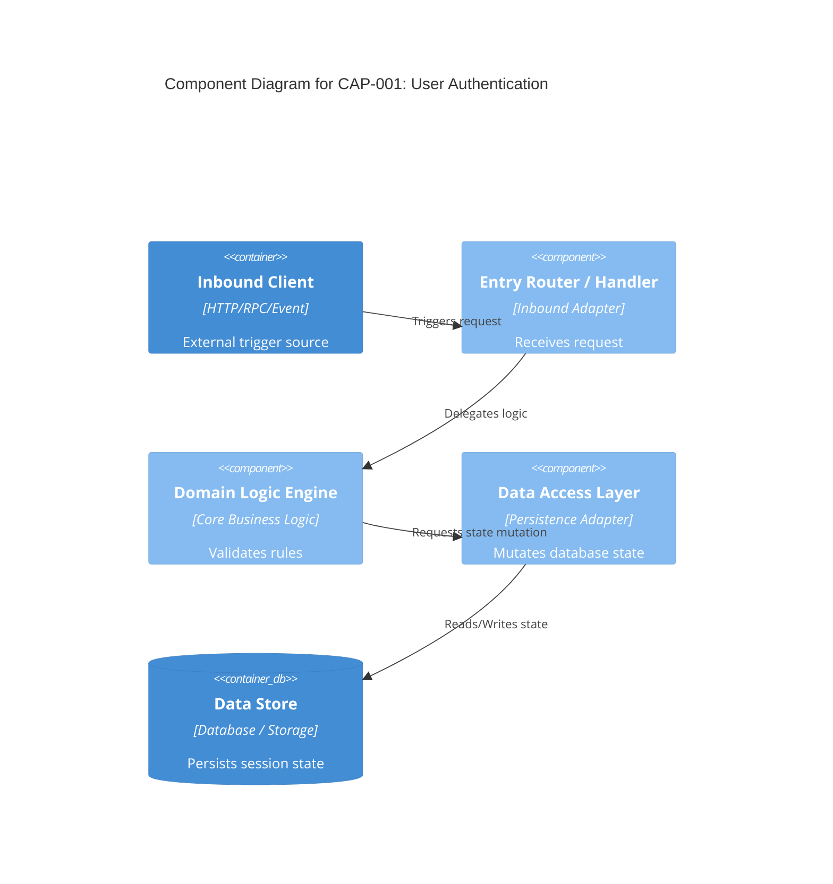

# OpenSpec Custom Skill: /opsx:build-baseline

## Description
Stateful, human-in-the-loop reverse engineering engine for OpenSpec. Performs broad, framework-agnostic system reconnaissance, locks in the detected stack, generates nested capability specifications, C4 diagrams, and multi-stakeholder views while enforcing pre-flight privacy guardrails.

---

## 🔒 STRICT PRIVACY, PII & SECRETS PRE-FLIGHT GUARDRAILS

To prevent accidental data exfiltration or sending sensitive enterprise code to external LLM servers:

### 1. In-Memory Local Sanitization & Masking
Before ANY source code, SQL script, schema file, or configuration file is processed or transmitted to an LLM prompt context, the agent MUST locally apply regex masking to sanitize the payload:
- **API Keys & Credentials:** Passwords, private keys, database connection strings, tokens, secrets $\rightarrow$ `<REDACTED_SECRET>`
- **Personal Identifiable Information (PII):**
    - National Identification / SSN / NRIC numbers $\rightarrow$ `S****123A`
    - Real Email addresses $\rightarrow$ `user@example.com`
    - Real Phone numbers $\rightarrow$ `+XX-XXXX-XXXX`
    - Real Names / Physical Addresses $\rightarrow$ Synthetic Mock Placeholders

### 2. Pre-Flight Pause & User Confirmation Gate
Before making any API call or transmitting context to an external LLM server for Phase 3 (Capability Slicing):
1. **List Files to be Sent:** Display the exact list of source files selected for analysis.
2. **Show Sanitized Preview:** Show a brief diff/snippet proving secrets and PII have been masked.
3. **HALT EXECUTION & ASK:**
   > ⚠️ **PRIVACY PRE-FLIGHT CHECK:**
   > I am about to send sanitized snippets of the following files to the LLM server:
   > - `<file_1>`
   > - `<file_2>`
   >
   > All credentials, keys, and PII have been masked locally.
   > Type **'yes'** or **'confirm'** to proceed, or type **'cancel'** to abort the request.

---

### PHASE 1: Broad System Reconnaissance (Fully Agnostic)
**Condition:** `openspec/specs/SYSTEM_MAP.md` DOES NOT EXIST and command is NOT a proposal request.

**Rule:** DO NOT assume any language, framework, or file extension upfront.

**Action:**
1. **Discover Ecosystem:** Inspect root directory for build definitions, manifests, and container configs (`package.json`, `pom.xml`, `build.gradle`, `go.mod`, `Cargo.toml`, `pyproject.toml`, `requirements.txt`, `Gemfile`, `Makefile`, `Dockerfile`, `docker-compose.yml`, etc.).
2. **Discover Persistence Layer:** Locate migration directories, ORM schemas, SQL scripts, protobufs, or OpenAPI specifications regardless of folder structure.
3. **Discover Entry Points:** Identify all entry mechanisms (HTTP handlers, RPC methods, event listeners, CLI interfaces, background jobs) purely from structural wiring.
4. Output the discovered map to `openspec/specs/SYSTEM_MAP.md` and record the **`.detected_ecosystem`**.

**Output Schema (`openspec/specs/SYSTEM_MAP.md`):**
```markdown
---
type: system_map
version: 1.0.0
detected_ecosystem: "<e.g., Go/Gin + PostgreSQL | Java/Spring + MySQL | Node/TypeScript + Mongo | Multi-Language>"
primary_languages: ["<lang_1>", "<lang_2>"]
entry_points_count: <number>
---

# System Map

## Discovered Modules & Infrastructure
- **Manifests & Configs:** `<file-list>`
- **Schemas / Migrations:** `<file-list>`
- **Primary Source Paths:** `<directory-list>`

## Discovered Entry Points
- `<protocol/type> <path/event/command>` -> `<Handler/Function>` (`file:lines`)
```

Human Prompt (STOP HERE):

>"Phase 1 Complete: System Map written to openspec/specs/SYSTEM_MAP.md.
>Identified Ecosystem: <detected_ecosystem>
>Review entry points and type 'yes' to proceed to Phase 2."

---

### PHASE 2: Capability Tree & Semantic Nesting (Adaptive)
**Condition:** `SYSTEM_MAP.md` EXISTS, but `openspec/specs/CAPABILITIES_TREE.md` DOES NOT EXIST.

**Action:**
1. Read `SYSTEM_MAP.md` and adopt specific conventions of the **`.detected_ecosystem`**.
2. Group discovered entry points into business capabilities using semantic IDs: `cap-XXX-<short-business-slug>` (e.g., `cap-001-user-auth`).
3. **Nested Slicing Rule:** If a capability touches >4 source files, split it into child sub-slices nested under the parent domain folder:
   - **Parent Overview Spec:** `openspec/specs/cap-001-user-auth/spec.md` (Domain purpose, entry points router, and sub-slice directory index)
   - **Child Sub-Slice 1:** `openspec/specs/cap-001-user-auth/cap-001a-token-validation/spec.md`
   - **Child Sub-Slice 2:** `openspec/specs/cap-001-user-auth/cap-001b-session-persistence/spec.md`
4. If a capability touches $\le$ 4 files, create a single spec at `openspec/specs/cap-XXX-<slug>/spec.md`.
5. Write initial index to `openspec/specs/CAPABILITIES_TREE.md`.

**Human Prompt (STOP HERE):**
> "Phase 2 Complete: Capability Tree written to `openspec/specs/CAPABILITIES_TREE.md`. Which capability ID would you like to analyze first?"

---

### PHASE 3: Thin-Slice Analysis (Stack-Tailored Analysis & C4 Diagrams)
**Condition:** User selects a capability ID from `CAPABILITIES_TREE.md`.

**Action:**
1. **State Guard:** Check selected capability status in `CAPABILITIES_TREE.md`.
    - **IF ALREADY COMPLETED:** HALT EXECUTION AND ASK:
      > 🛑 **STATE GUARD:** Capability `<id>` is currently marked as **Completed**.
      > Do you want to **re-analyze** and overwrite it, or **skip** and choose another capability?
2. **Execute Pre-Flight Privacy Gate:** Display target files and sanitized diff preview. Wait for explicit user confirmation.
3. Upon confirmation, read target source files (max 4 per pass) using framework-appropriate patterns derived from `SYSTEM_MAP.md`.
4. Generate target `spec.md` using exact code line citations and embedded Mermaid C4 diagrams:

**Frontmatter Field Rules:**
- `type`: Must be `capability_specification` (or `capability_proposal` for proposals).
- `capability_id`: Unique semantic ID matching the directory name (e.g., `cap-001-user-auth`).
- `capability_name`: Human-readable title describing the business function.
- `version`: Semantic version string (e.g., `1.0.0`).
- `status`: Must be one of `[completed, pending_approval]`. Set to `pending_approval` if `confidence_level` is not `confirmed`.
- `confidence_level`: Must be one of `[confirmed, needs_confirmation, unverified]`.
- `confidence_score`: Integer percentage string between `0%` and `100%`.
- `unverified_assumptions`: Array of strings listing any unconfirmed code behaviors or missing dependencies. Must be `[]` if empty.
- `stability`: Architectural health of source code. Must be one of `[stable, deprecated, flaky]`.
- `created_at`: Creation date as ISO date string (`YYYY-MM-DD`).
- `created_by`: Name of agent or developer (`codeinSPECtor`).
- `linked_capabilities`: Array of directly coupled capability IDs (e.g., `[cap-002-user-profile]`). Must be `[]` if none.
- `linked_issues`: Array of associated ticket/issue IDs (e.g., `[SEC-102]`). Must be `[]` if none.

**Spec Output Template starts here:**
```yaml
---
type: capability_specification
capability_id: cap-001-user-auth
capability_name: User Authentication & Token Validation
version: 1.0.0
status: completed
confidence_level: confirmed
confidence_score: 95%
unverified_assumptions: []
stability: stable
created_at: 2026-09-23
created_by: codeinSPECtor
linked_capabilities: [cap-002-user-profile]
linked_issues: []
---
```
# Capability: User Authentication & Token Validation

## 1. Domain Purpose & Business Intent
<High-level business capability summary>

## 2. Technical Entry Points & Security Gates
- **Interface / Route:** `POST /api/v1/auth/login`
- **Handler / Function:** `<file_path:lines>`
- **Middleware / Interceptor:** `<file_path:lines>`

## 3. C4 Component Architecture Diagram

4. Database Schema & State MutationsEntity / Table / StoreMutation TypeKey Fields MutatedSource Code Citationuser_sessionsINSERTsession_token, expires_at<file_path:lines>5. Behavior Scenarios (Gherkin BDD)Scenario: Valid Credentials SubmissionGiven a registered user with valid credentials (<file_path:lines>)When the login endpoint or function is executedThen return authorization token with successful status (<file_path:lines>)Evidence Citation: <file_path:lines>6. Failure & Error MatrixError ConditionTrigger RuleError / Status CodeEvidence CitationExpired Token / SessionTimestamp exceeds lifetime threshold401 Unauthorized / AuthException<file_path:lines>
5. Update status in `openspec/specs/CAPABILITIES_TREE.md` to `Completed` (or `Pending approval` if confidence is low).

**Spec Output Template ends here.**

**Human Prompt (STOP HERE):**
> "Phase 3 Complete: Written spec to target directory. Type another capability ID to analyze next, or type **'aggregate'** to run Phase 4."

---

### PHASE 4: Baseline Consolidation & Master C4
**Condition:** User requests **'aggregate'** or **'build baseline'**.

1. Traverse all `openspec/specs/` subdirectories and read completed specs.
2. **Generate Master System C4 Diagram:**
    - Synthesize component interactions across completed capabilities into a master system C4 Context/Container diagram saved at `openspec/specs/SYSTEM_C4_DIAGRAM.md`.
3. **Generate Central Navigation Index (`openspec/specs/INDEX.md`):**
    - Output summary table mapping IDs, Semantic Names, Completion Status, Confidence Levels, per-capability spec links, and per-capability C4 diagram links.
    - Include direct link to `openspec/specs/SYSTEM_C4_DIAGRAM.md`.
4. **Generate Dependency Map (`openspec/specs/DEPENDENCY_MAP.md`):**
    - Aggregate shared data stores, direct service calls, and async events between capabilities into a Mermaid call graph.
5. **Generate RAID Spec (`openspec/specs/RAID_LOG.md`):**
    - Aggregate all Risks, Assumptions, Known Issues, Technical Debt, and any unmasked legacy code warnings.
6. **Compile Global Baseline (`openspec/specs/BASELINE.md`):**
    - **Global Domain Glossary:** Consolidated business terms across all capabilities.
    - **Consolidated Behavior Scenarios:** All Gherkin BDD scenarios grouped by capability.
    - **Global Failure & Error Matrix:** Merged table of all status codes, exceptions, and trigger conditions.

**Human Prompt & Action Routing (STOP HERE):**
> "🎉 OpenSpec Aggregation Complete!
> Updated Master Artifacts:
> - `openspec/specs/INDEX.md` (Master navigation index, confidence status & C4 links)
> - `openspec/specs/SYSTEM_C4_DIAGRAM.md` (Master architecture C4 diagram)
> - `openspec/specs/BASELINE.md` (Merged system baseline, global glossary & error matrix)
> - `openspec/specs/DEPENDENCY_MAP.md` (Cross-capability coupling graph)
> - `openspec/specs/RAID_LOG.md` (Aggregated risks, assumptions & tech debt)
>
> **Next Steps - Choose an Option:**
> 1. Type a remaining pending capability ID to continue reverse-engineering.
> 2. Type **'render <client | architect | developer | agent>'** to generate a customized stakeholder view.
> 3. Type **'proposal <feature-name>'** to set up a new native OpenSpec change proposal under `openspec/changes/`."

---

### OPTIONAL PHASE: Multi-Stakeholder View Generation
**Condition:** User requests **'render <view-type>'** after baseline aggregation or proposal creation.

**Action:** Render customized, audience-specific perspectives derived strictly from `BASELINE.md` and `SYSTEM_C4_DIAGRAM.md`:
- **`render client` / `render ba`:** Renders non-technical business executive summary, user impact, compliance rules, and plain-language Gherkin scenarios (hides internal code/file citations).
- **`render architect`:** Renders system boundary map, Master C4 diagrams, Mermaid coupling sequence diagrams, global failure recovery strategies, and high-priority RAID risks.
- **`render developer`:** Renders consolidated data schema mutations, field constraints, test coverage gaps, local seed requirements, and exact file:line citations.
- **`render agent`:** Renders pure machine-readable YAML/JSON frontmatter schemas and deterministic behavior stubs for TDD modernization.