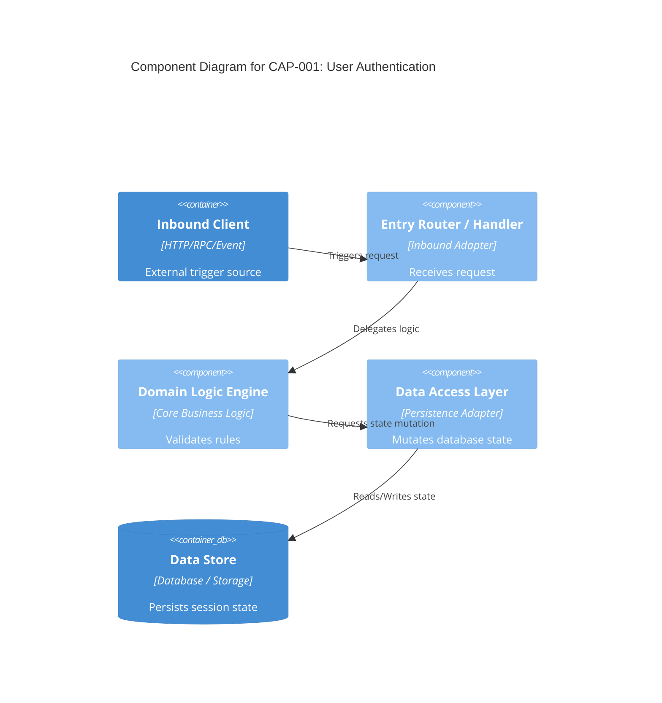

### PHASE 3: Thin-Slice Analysis (Stack-Tailored Analysis & C4 Diagrams)
**Condition:** User selects a capability ID from `CAPABILITIES_TREE.md`.

**Action:**
1. **State Guard:** Check selected capability status in `CAPABILITIES_TREE.md`.
    - **IF ALREADY COMPLETED:** HALT EXECUTION AND ASK:
      > 🛑 **STATE GUARD:** Capability `<id>` is currently marked as **Completed**.
      > Do you want to **re-analyze** and overwrite it, or **skip** and choose another capability?
2. **Execute Pre-Flight Privacy Gate:** Display target files and sanitized diff preview. Wait for explicit user confirmation.
3. Upon confirmation, read target source files (max 4 per pass) using framework-appropriate patterns derived from `SYSTEM_MAP.md`.
4. Generate target `spec.md` using exact code line citations and embedded Mermaid C4 diagrams:

**Frontmatter Field Rules:**
- `type`: Must be `capability_specification` (or `capability_proposal` for proposals).
- `capability_id`: Unique semantic ID matching the directory name (e.g., `cap-001-user-auth`).
- `capability_name`: Human-readable title describing the business function.
- `version`: Semantic version string (e.g., `1.0.0`).
- `status`: Must be one of `[completed, pending_approval]`. Set to `pending_approval` if `confidence_level` is not `confirmed`.
- `confidence_level`: Must be one of `[confirmed, needs_confirmation, unverified]`.
- `confidence_score`: Integer percentage string between `0%` and `100%`.
- `unverified_assumptions`: Array of strings listing any unconfirmed code behaviors or missing dependencies. Must be `[]` if empty.
- `stability`: Architectural health of source code. Must be one of `[stable, deprecated, flaky]`.
- `created_at`: Creation date as ISO date string (`YYYY-MM-DD`).
- `created_by`: Name of agent or developer (`codeinSPECtor`).
- `linked_capabilities`: Array of directly coupled capability IDs (e.g., `[cap-002-user-profile]`). Must be `[]` if none.
- `linked_issues`: Array of associated ticket/issue IDs (e.g., `[SEC-102]`). Must be `[]` if none.

**Spec Output Template starts here:**
```yaml
---
type: capability_specification
capability_id: cap-001-user-auth
capability_name: User Authentication & Token Validation
version: 1.0.0
status: completed
confidence_level: confirmed
confidence_score: 95%
unverified_assumptions: []
stability: stable
created_at: 2026-09-23
created_by: codeinSPECtor
linked_capabilities: [cap-002-user-profile]
linked_issues: []
---
```
# Capability: User Authentication & Token Validation

## 1. Domain Purpose & Business Intent
<High-level business capability summary>

## 2. Technical Entry Points & Security Gates
- **Interface / Route:** `POST /api/v1/auth/login`
- **Handler / Function:** `<file_path:lines>`
- **Middleware / Interceptor:** `<file_path:lines>`

## 3. C4 Component Architecture Diagram

4. Database Schema & State MutationsEntity / Table / StoreMutation TypeKey Fields MutatedSource Code Citationuser_sessionsINSERTsession_token, expires_at<file_path:lines>5. Behavior Scenarios (Gherkin BDD)Scenario: Valid Credentials SubmissionGiven a registered user with valid credentials (<file_path:lines>)When the login endpoint or function is executedThen return authorization token with successful status (<file_path:lines>)Evidence Citation: <file_path:lines>6. Failure & Error MatrixError ConditionTrigger RuleError / Status CodeEvidence CitationExpired Token / SessionTimestamp exceeds lifetime threshold401 Unauthorized / AuthException<file_path:lines>
5. Update status in `openspec/specs/CAPABILITIES_TREE.md` to `Completed` (or `Pending approval` if confidence is low).

**Spec Output Template ends here.**

**Human Prompt (STOP HERE):**
> "Phase 3 Complete: Written spec to target directory. Type another capability ID to analyze next, or type **'aggregate'** to run Phase 4."