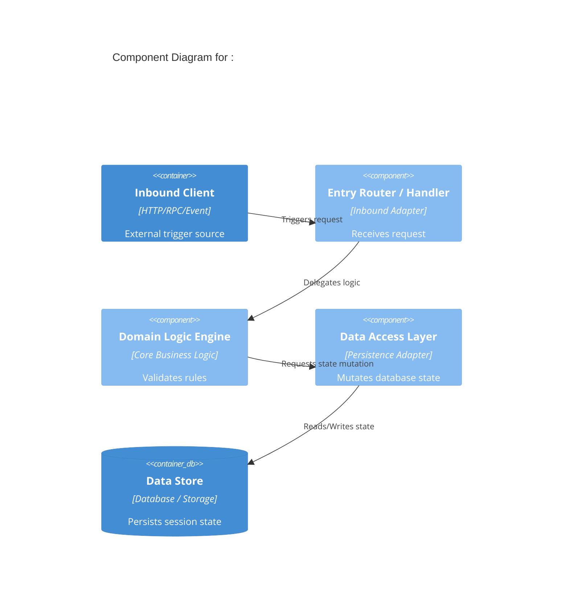
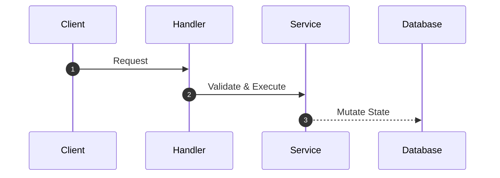
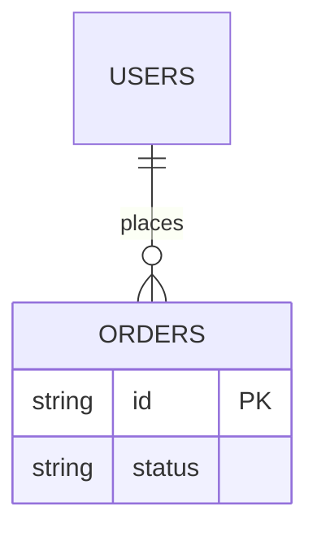
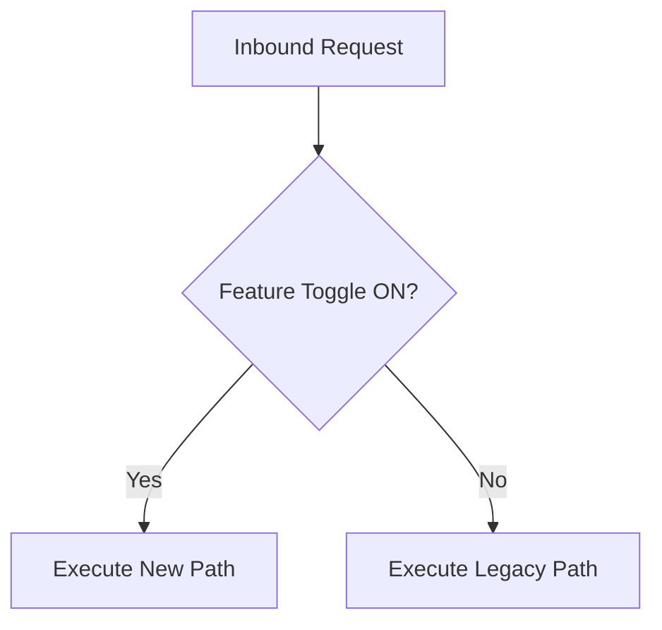

# PHASE 3: Thin-Slice Analysis (Stack-Tailored Analysis & Dynamic Multi-Diagrams)
**Condition:** User selects a capability ID from `CAPABILITIES_TREE.md`.

**Action:**
## 1. **State Guard:** Check selected capability status in `CAPABILITIES_TREE.md`.
   - **IF ALREADY COMPLETED:** HALT EXECUTION AND ASK:
     > 🛑 **STATE GUARD:** Capability `<id>` is currently marked as **Completed**.
     > Do you want to **re-analyze** and overwrite it, or **skip** and choose another capability?
## 2. **Execute Pre-Flight Privacy Gate:** Display target files and sanitized diff preview. Wait for explicit user confirmation.
## 3. Upon confirmation, read target source files (max 4 per pass) using framework-appropriate patterns derived from `SYSTEM_MAP.md`.
## 4. **Dynamic Diagram Selection Rule (Include Diagrams Wherever Required):**
   - **C4 Component Architecture Diagram:** Include if the capability involves distinct component layers, adapters, or structural system boundaries.
   - **Sequence Diagram:** Include if multi-step API flows, async events, multi-service communications, or 3rd-party integration handshakes exist.
   - **ER Diagram:** Include if data persistence, tables, or ORM entity relationships are touched.
   - **Flowchart:** Include if complex branching logic, decision trees, or feature flag paths exist.
   - **Circular & Shared Boundary Handling:** When analyzing \`CAP-A\`, if it calls \`CAP-B\` and \`CAP-B\` calls \`CAP-A\`, DO NOT analyze \`CAP-B\` source code inline. Treat \`CAP-B\` as an external boundary call in Section 3 (Sequence Diagram), record \`cyclic_dependencies: ["CAP-B"]\` in frontmatter, and log the coupling in \`RAID_LOG.md\`. For \`cap-000-*\` infrastructure utilities, list them in \`linked_capabilities\` without re-analyzing utility source code.

## 5. Generate target `spec.md` using exact code line citations and embedded Mermaid diagrams:

**Frontmatter Field Rules:**
- `type`: Must be `capability_specification`.
- `capability_id`: Unique semantic ID matching the directory name (e.g., `cap-001-user-auth`).
- `capability_name`: Human-readable title describing the business function.
- `version`: Semantic version string (e.g., `1.0.0`).
- `status`: Must be one of `[completed, pending_approval]`. Set to `pending_approval` if `confidence_level` is not `confirmed`.
- `confidence_level`: Must be one of `[confirmed, needs_confirmation, unverified]`.
- `confidence_score`: Integer percentage string between `0%` and `100%`.
- `unverified_assumptions`: Array of strings listing any unconfirmed code behaviors or missing dependencies. Must be `[]` if empty.
- `stability`: Architectural health of source code. Must be one of `[stable, deprecated, flaky]`.
- `created_at`: Creation date as ISO date string (`YYYY-MM-DD`).
- `created_by`: Name of agent or developer (`codeinSPECtor`).
- `linked_capabilities`: Array of directly coupled capability IDs (e.g., `[cap-002-user-profile]`). Must be `[]` if none.
- `linked_issues`: Array of associated ticket/issue IDs (e.g., `[SEC-102]`). Must be `[]` if none.
- `cyclic_dependencies`: Array of capability IDs that form a cyclic dependency with this capability. Must be `[]` if none.
- `has_domain_leak`: Boolean indicating if this capability directly mutates state belonging to another domain. Must be `false` if none.
- `leaked_domains`: Array of capability IDs that this capability mutates state for, if `has_domain_leak` is `true`. Must be `[]` if none.

**Spec Output Template:**

[//]: # (template starts)
```yaml
---
type: capability_specification
capability_id: cap-001-user-auth
capability_name: User Authentication & Token Validation
version: 1.0.0
status: completed
confidence_level: confirmed
confidence_score: 95%
unverified_assumptions: []
stability: stable
created_at: 2026-09-24
created_by: codeinSPECtor
linked_capabilities: [cap-002-user-profile]
linked_issues: []
cyclic_dependencies: []
has_domain_leak: false
leaked_domains: []
---
```

# Capability: <Capability Name>

## 1. Domain Purpose & Business Intent
High-level business capability summary

## 2. Technical Entry Points & Security Gates
- **Interface / Route:** `<route/method>`
- **Handler / Function:** `<file_path:lines>`
- **Middleware / Interceptor:** `<file_path:lines>`

## 3. Visual Architecture & Workflow Diagrams

### 3.1 C4 Component Architecture Diagram (Mandatory)


### 3.2 Sequence Diagram (Include if Multi-Step / Async / Multi-Service)


### 3.3 Entity Relationship (ER) Diagram (Include if Schema / Database Touched)


### 3.4 Decision Flowchart (Include if Complex Logic / Feature Flag Paths Exist)


## 4. Database Schema & State Mutations
| Entity / Table / Store | Mutation Type | Key Fields Mutated | Source Code Citation |
|---|---|---|---|
| `<table_name>` | `<INSERT/UPDATE>` | `<fields>` | `<file_path:lines>` |

## 5. Behavior Scenarios (Gherkin BDD)
#### Scenario: <Scenario Name>
- **Given** <precondition> (`<file_path:lines>`)
- **When** <action>
- **Then** <expected outcome> (`<file_path:lines>`)
- **Evidence Citation:** `<file_path:lines>`

## 6. Failure & Error Matrix
| Error Condition | Trigger Rule | Error / Status Code | Evidence Citation |
|---|---|---|---|
| `<Error>` | `<Rule>` | `<Status>` | `<file_path:lines>` |

[//]: # (template ends)

## 6. Update status in `openspec/specs/CAPABILITIES_TREE.md` to `Completed` (or `Pending approval` if confidence is low).

**Human Prompt (STOP HERE):**
> "Phase 3 Complete: Written spec to target directory. Type another capability ID to analyze next, or type **'aggregate'** to run Phase 4."