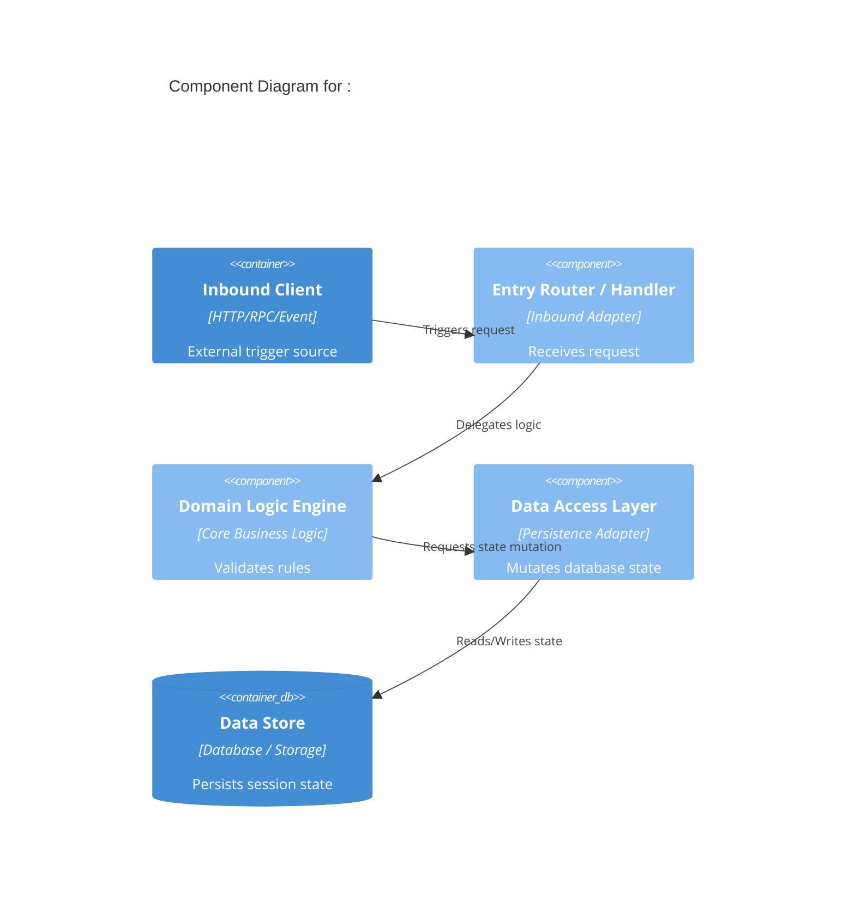
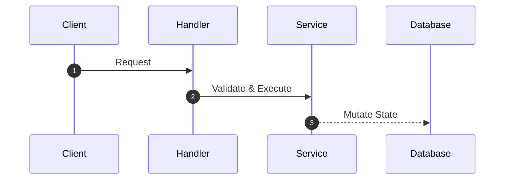
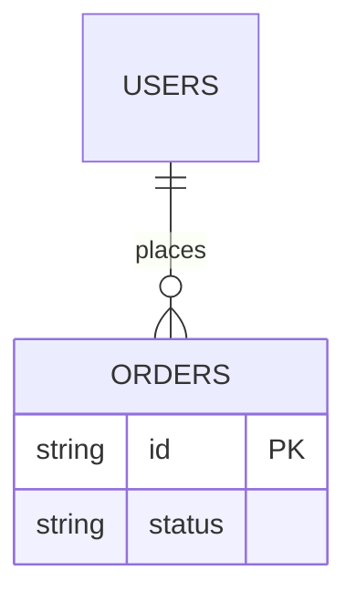
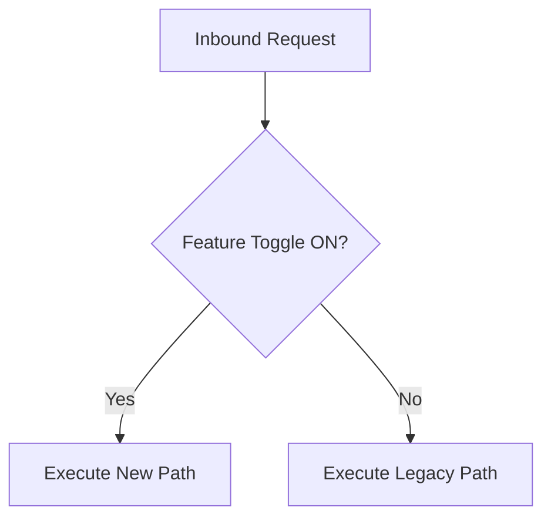

### PHASE 3: Thin-Slice Analysis (Stack-Tailored Analysis & Dynamic Multi-Diagrams)
**Condition:** User selects a capability ID from `CAPABILITIES_TREE.md`.

**Token & Context Optimization Rules:**
- **AST Skeleton-First File Reading:** For source files >500 lines, extract class/method AST signatures first; fetch full method bodies strictly along active execution paths.
- **Context Pass Limit:** Read a maximum of 4 source files per reading pass to preserve context window capacity.
- **Multi-File Batch Slicing (>4 Files):** If a capability touches >4 files (e.g., 10 files across multi-layer stacks), process in **chained 4-file batch passes**, carrying forward key interface signatures.
- **Diagram Bounding:** Cap Mermaid sequence diagrams at 25 interaction steps and flowcharts at 30 nodes to avoid context truncation.
- **Diff-Based Spec Modification:** If the user requests modifications during the review stage, apply targeted Markdown edits/diffs rather than regenerating the entire `spec.md` file.

**Action:**
## 1. **State Guard:** Check selected capability status in `CAPABILITIES_TREE.md`.
- **IF ALREADY COMPLETED:** HALT EXECUTION AND ASK:
  > 🛑 **STATE GUARD:** Capability `<id>` is currently marked as **Completed**.
  > Do you want to **re-analyze** and overwrite it, or **skip** and choose another capability?
## 2. **Execute Conditional Pre-Flight Privacy Gate:** Scan target files in-memory. If PII/secrets or threats are found, pause and request confirmation. Otherwise, proceed directly.
## 3. **Read Source Files:** Read target source files using AST skeleton-first strategy based on `.detected_ecosystem` in `SYSTEM_MAP.md`.
## 4. **Dynamic Diagram Selection Rule:**
- **C4 Component Architecture Diagram:** Include if distinct component layers, adapters, or structural boundaries exist.
- **Sequence Diagram:** Include if multi-step API flows, async events, multi-service communications, or 3rd-party handshakes exist.
- **ER Diagram:** Include if data persistence, tables, or ORM entity relationships are touched.
- **Flowchart:** Include if complex branching logic, decision trees, or feature flag paths exist.
- **Circular & Shared Boundary Handling:** When analyzing `CAP-A`, if it calls `CAP-B` and `CAP-B` calls `CAP-A`, DO NOT analyze `CAP-B` source code inline. Treat `CAP-B` as an external boundary call in Section 3 (Sequence Diagram), record `cyclic_dependencies: ["CAP-B"]` in frontmatter, and log the coupling in `RAID_LOG.md`. For `cap-000-*` infrastructure utilities, list them in `linked_capabilities` without re-analyzing utility source code.
## 5. **Self-Critique & Anti-Loop Guardrail (Ralph Loop Validation):**
- **Line Citation Verification:** Double-check every `file_path:lines` citation against raw source files. Correct line shifts immediately before generating `spec.md`.
- **Loop Break Rule:** If an unverified assumption cannot be resolved after 2 reading attempts, DO NOT guess. Mark `confidence_level: needs_confirmation`, set `status: pending_approval`, document gaps in `unverified_assumptions: [...]`, and flag in `RAID_LOG.md`.
## 6. **Generate Capability Specification (`spec.md`):** Output target spec using exact line citations, upfront BDD scenarios, and embedded Mermaid diagrams:

**Frontmatter Field Rules:**
- `type`: Must be `capability_specification`.
- `capability_id`: Unique semantic ID matching the directory name (e.g., `cap-001-user-auth`).
- `capability_name`: Human-readable title describing the business function.
- `version`: Semantic version string (e.g., `1.0.0`).
- `status`: Set to `pending_approval` upon initial generation.
- `confidence_level`: Must be one of `[confirmed, needs_confirmation, unverified]`.
- `confidence_score`: Integer percentage string between `0%` and `100%`.
- `unverified_assumptions`: Array of unconfirmed code behaviors or missing dependencies (`[]` if empty).
- `stability`: Architectural health (`[stable, deprecated, flaky]`).
- `created_at`: Creation date as ISO date string (`YYYY-MM-DD`).
- `created_by`: Name of agent or developer (`codeinSPECtor`).
- `linked_capabilities`: Array of directly coupled capability IDs (`[]` if none).
- `linked_issues`: Array of associated ticket IDs (`[]` if none).
- `cyclic_dependencies`: Array of cyclic capability IDs (`[]` if none).
- `has_domain_leak`: Boolean indicating if state in another domain is directly mutated.
- `leaked_domains`: Array of mutated domain capability IDs (`[]` if none).

**Spec Output Template:**

[//]: # (template starts)
```yaml
---
type: capability_specification
capability_id: cap-001-user-auth
capability_name: User Authentication & Token Validation
version: 1.0.0
status: pending_approval
confidence_level: confirmed
confidence_score: 95%
unverified_assumptions: []
stability: stable
created_at: 2026-09-30
created_by: codeinSPECtor
linked_capabilities: [cap-002-user-profile]
linked_issues: []
cyclic_dependencies: []
has_domain_leak: false
leaked_domains: []
---
```

# Capability: <Capability Name>

## 1. Domain Purpose & Technical Entry Points
- **Domain Intent:** High-level business capability summary
- **Interface / Route:** `<route/method>`
- **Handler / Function:** `<file_path:lines>`
- **Middleware / Interceptor:** `<file_path:lines>`

## 2. Behavior Scenarios (Gherkin BDD)
#### Scenario: <Scenario Name>
- **Given** <precondition> (`<file_path:lines>`)
- **When** <action>
- **Then** <expected outcome> (`<file_path:lines>`)
- **Evidence Citation:** `<file_path:lines>`

## 3. Visual Architecture & Workflow Diagrams

### 3.1 C4 Component Architecture Diagram (Mandatory)

```mermaid
C4Component
title Component Diagram for <CAP-ID>: <Name>
Container(client, "Inbound Client", "HTTP/RPC/Event", "External trigger source")
Component(entryPoint, "Entry Router / Handler", "Inbound Adapter", "Receives request")
Component(authService, "Domain Logic Engine", "Core Business Logic", "Validates rules")
Component(dataAdapter, "Data Access Layer", "Persistence Adapter", "Mutates database state")
ContainerDb(db, "Data Store", "Database / Storage", "Persists session state")

    Rel(client, entryPoint, "Triggers request")
    Rel(entryPoint, authService, "Delegates logic")
    Rel(authService, dataAdapter, "Requests state mutation")
    Rel(dataAdapter, db, "Reads/Writes state")
```

### 3.2 Sequence Diagram (Include if Multi-Step / Async / Multi-Service)

```mermaid
sequenceDiagram
autonumber
Client->>Handler: Request
Handler->>Service: Validate & Execute
Service-->>Database: Mutate State
```

### 3.3 Entity Relationship (ER) Diagram (Include if Schema / Database Touched)

```mermaid
erDiagram
USERS ||--o{ ORDERS : places
ORDERS {
string id PK
string status
}
```

### 3.4 Decision Flowchart (Include if Complex Logic / Feature Flag Paths Exist)

```mermaid
flowchart TD
A[Inbound Request] --> B{Feature Toggle ON?}
B -- Yes --> C[Execute New Path]
B -- No --> D[Execute Legacy Path]
```

## 4. Database Schema & State Mutations
| Entity / Table / Store | Mutation Type     | Key Fields Mutated | Source Code Citation |
|------------------------|-------------------|--------------------|----------------------|
| `<table_name>`         | `<INSERT/UPDATE>` | `<fields>`         | `<file_path:lines>`  |

## 5. Failure & Error Matrix
| Error Condition | Trigger Rule | Error / Status Code | Evidence Citation   |
|-----------------|--------------|---------------------|---------------------|
| `<Error>`       | `<Rule>`     | `<Status>`          | `<file_path:lines>` |

[//]: # (template ends)

## 7. Staging Status: Update status in `openspec/specs/CAPABILITIES_TREE.md` to `pending_approval`.

**Human Prompt (APPROVAL GATE & STOP HERE):**
> Phase 3 Complete: Generated spec at `openspec/specs/<cap-id>/spec.md` (Status: pending_approval).
> Please review the spec.
> - Type **'approve'** to confirm and promote status to **Completed** in `CAPABILITIES_TREE.md`.
> - Type your feedback to request modifications.

**Human Prompt (POST-APPROVAL / IDLE GATE):**
> Capability `<cap-id>` marked as **Completed**.
> - Type another capability ID to analyze next, or type **'aggregate'** to run Phase 4.